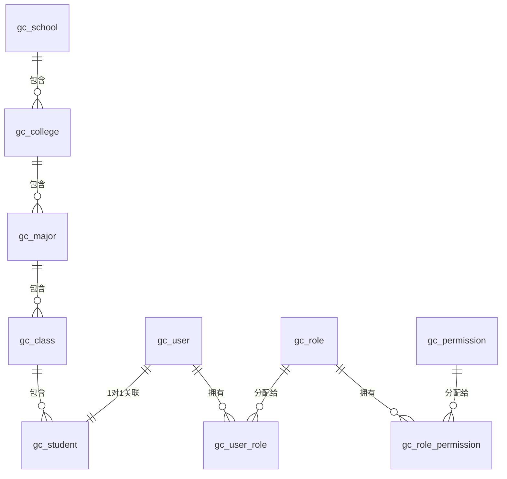
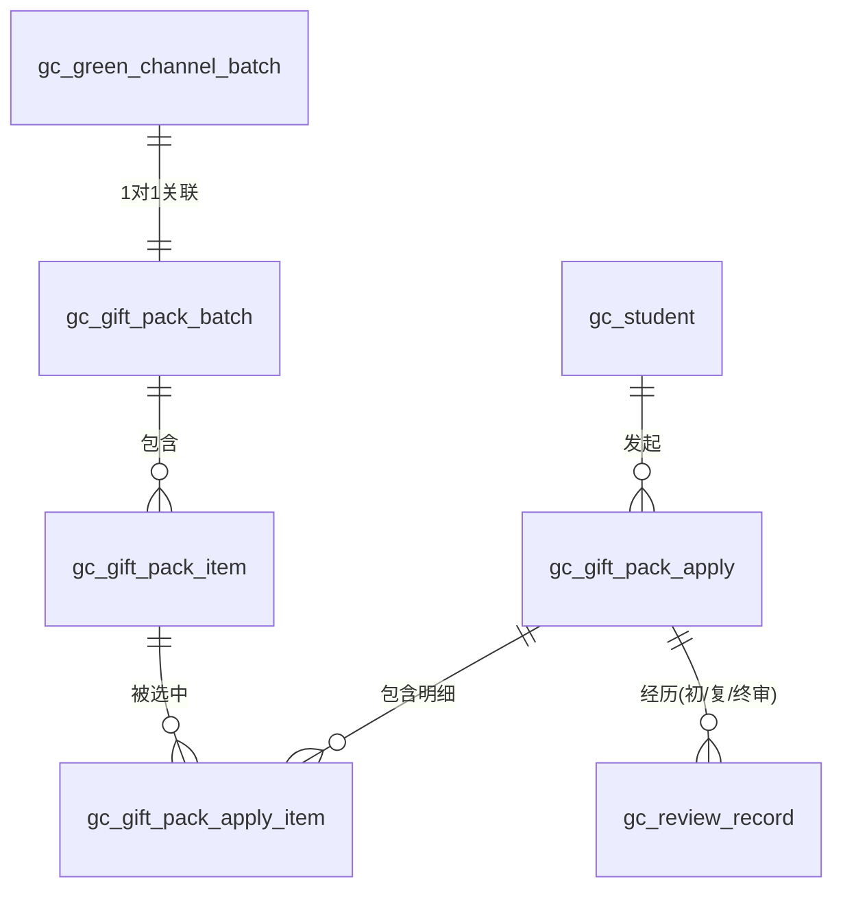
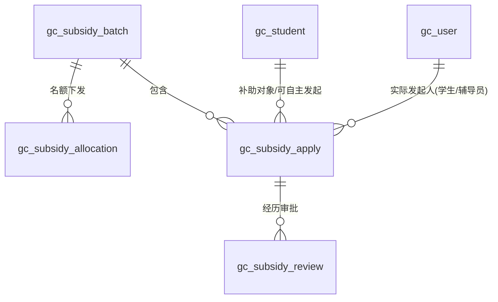
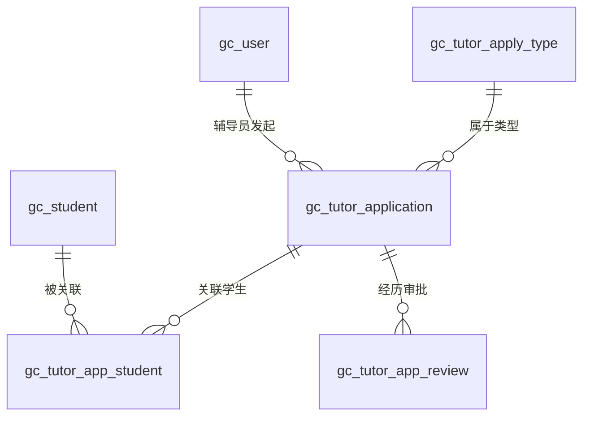
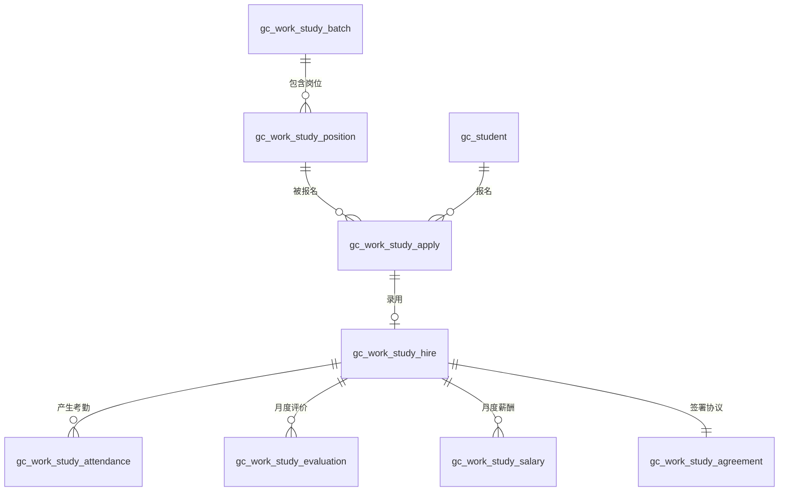

# 高校绿色通道系统 — 数据库设计说明

> 状态：现行数据库设计说明
> 最后核验：2026-07-22（业务实体所用表均可在建库脚本中找到）
> 维护人：A 维护公共表；各成员维护自己业务域表
> 权威脚本：`../03-数据库/数据库设计.sql`

## 1. 概述
本文档详细描述了高校绿色通道系统的数据库设计，包括核心实体关系（ER图）、各表分组说明以及核心表字段的详细定义。
该系统采用 MySQL 8.0 构建，基于 utf8mb4 字符集。表名统一前缀为 `gc_`。所有表均包含主键 `id`、审计字段 `create_time` 和 `update_time`，以及逻辑删除标志 `is_deleted`。

## 2. ER关系图

为了清晰展示系统实体之间的关联，我们将 ER 图按核心业务进行拆分展示。

### 2.1 组织架构与用户体系 ER 图

### 2.2 绿色通道与大礼包业务 ER 图

### 2.3 困难补助业务 ER 图

## 3. 表分组说明

数据库包含 40 张表，按业务模块划分为以下几大核心组：
1. **用户与权限组**：实现基于 RBAC 模型的权限管理（用户、角色、权限及其关联表）和系统操作日志。
2. **组织架构组**：维护学校、学院、专业、班级的层级关系。
3. **学生信息组**：存储学生档案、家庭成员信息和经学校认定的困难等级。
4. **绿色通道配置组**：集中配置绿色通道开放批次、爱心大礼包物资库与名额分配。
5. **绿色通道申请组**：记录学生自主提交的大礼包申请及选中物品明细，统一管理上传附件（含OCR识别数据）。
6. **审核流程组**：记录三级联动审批的详细流水（通过/驳回/修改），配置审核意见模板及超时催办规则。
7. **困难补助组**：管理生活/路费/临时补助的批次、额度分配和申请流转；同时支持学生自主申请与辅导员主动申请。
8. **系统配置组**：管理系统全局参数（开关、阈值）及动态数据字典（枚举值）。

## 4. 核心表字段说明

> 注：以下仅列出业务核心字段，所有表默认带有的 `id`, `create_time`, `update_time`, `is_deleted` 省略。

### 4.1 `gc_student` 学生基本信息表
| 字段名 | 类型 | 必填 | 说明 |
| :--- | :--- | :--- | :--- |
| `user_id` | BIGINT | 是 | 关联系统账户表 ID |
| `student_no` | VARCHAR(50) | 是 | 唯一学号 |
| `name` | VARCHAR(50) | 是 | 真实姓名 |
| `id_card` | VARCHAR(255) | 是 | 身份证号（加密存储） |
| `college_id` / `major_id` | BIGINT | 是 | 归属学院/专业 ID |
| `poverty_level` | TINYINT | 否 | 经学校认定的困难等级 |
| `is_registered_poor` | TINYINT(1) | 否 | 是否建档立卡 |

### 4.2 `gc_green_channel_batch` 绿色通道批次表
| 字段名 | 类型 | 必填 | 说明 |
| :--- | :--- | :--- | :--- |
| `batch_name` | VARCHAR(100) | 是 | 批次名称(如"2023新生绿色通道") |
| `academic_year` | VARCHAR(20) | 是 | 学年 |
| `apply_start_time` | DATETIME | 是 | 学生申请开放时间 |
| `apply_end_time` | DATETIME | 是 | 学生端申请截止时间 |
| `college_submit_end_time` | DATETIME | 是 | 学院审核后提交至学校截止时间 |
| `status` | TINYINT | 否 | 0-未开始 1-进行中 2-已结束 |

### 4.3 `gc_subsidy_apply` 补助申请表
| 字段名 | 类型 | 必填 | 说明 |
| :--- | :--- | :--- | :--- |
| `batch_id` | BIGINT | 是 | 补助批次 ID |
| `student_id` | BIGINT | 是 | 补助对象学生 ID |
| `applicant_type` | TINYINT | 是 | 1-学生自主申请 2-辅导员主动申请 |
| `applicant_user_id` | BIGINT | 是 | 实际发起人用户 ID |
| `apply_no` | VARCHAR(50) | 是 | 申请单全局唯一编号 |
| `apply_amount` | DECIMAL(10,2)| 是 | 申请补助金额 |
| `status` | TINYINT | 是 | 当前申请状态（枚举见数据字典）|
| `approved_amount` | DECIMAL(10,2) | 否 | 学校终审确定的发放金额 |

### 4.4 `gc_review_record` 审核记录表
| 字段名 | 类型 | 必填 | 说明 |
| :--- | :--- | :--- | :--- |
| `apply_id` | BIGINT | 是 | 被审核的业务单 ID |
| `apply_type` | TINYINT | 是 | 1-大礼包 2-补助 |
| `reviewer_id` | BIGINT | 是 | 审核人 ID |
| `reviewer_role` | TINYINT | 是 | 审核人的角色层级：1-辅导员 2-学院 3-学校 |
| `action` | TINYINT | 是 | 1-通过 2-驳回修改 3-不通过 4-修改 |
| `modified_content` | JSON | 否 | 若审核人修改了表单，记录修改前后对比快照 |

## 5. 索引设计说明
为了保证系统在海量并发下的查询效率，我们对核心表设计了如下索引：
1. **唯一性索引 (UNIQUE KEY)**：
   * 对具有业务唯一性的字段加唯一约束。如：`gc_user.username` (登录名)，`gc_student.student_no` (学号)，`gc_subsidy_apply.apply_no` (申请流水号)。
   * 对联合约束加唯一索引。如：`gc_user_role(user_id, role_id)`，防止重复分配角色；`gc_subsidy_apply(batch_id, student_id)` 确保无论学生或辅导员发起，一个批次内每个学生只有一条有效申请。
2. **普通索引 (KEY)**：
   * **外键查询列**：虽然不建立物理外键，但对逻辑外键字段建立索引，加速 JOIN 操作。如所有表中的 `college_id`, `batch_id`, `student_id`。
   * **状态分类列**：`gc_subsidy_apply.status`，优化管理员在后台通过状态过滤待办列表的查询速度。
   * **时间检索列**：`gc_operation_log(user_id, operation_time)`，便于快速检索某用户在某段时间的操作流水。

## 6. 数据字典值域说明 (gc_dictionary)
系统中多处状态和类型定义通过数据字典动态配置，以下为核心初始化值域：

| 字典类型 (dict_type_code) | 字典项键 (item_code) | 字典项值 (item_name) |
| :--- | :--- | :--- |
| **APPLY_STATUS** (申请单状态) | 1 | 草稿 |
| | 2 | 待辅导员审核 |
| | 3 | 待学院审核 |
| | 4 | 待学校审核 |
| | 5 | 已通过 |
| | 6 | 已驳回 |
| | 7 | 不通过 |
| | 8 | 已取消 |
| **POVERTY_LEVEL** (贫困等级) | 1 | 特别困难 |
| | 2 | 困难 |
| | 3 | 一般困难 |
| | 4 | 不困难 |
| **GENDER** (性别) | 1 | 男 |
| | 2 | 女 |

## 7. 新增表组（V1.1）

### 7.1 辅导员事务申请组 ER 图

### 7.2 勤工助学组 ER 图

### 7.3 辅导员事务申请组表说明

#### `gc_tutor_apply_type` 申请类型配置表
| 字段名 | 类型 | 必填 | 说明 |
| :--- | :--- | :--- | :--- |
| `type_name` | VARCHAR(100) | 是 | 申请类型名称 |
| `type_code` | VARCHAR(50) | 是 | 唯一编码 |
| `need_amount` | TINYINT(1) | 否 | 是否需要金额字段 |
| `need_student` | TINYINT(1) | 否 | 是否需要关联学生 |
| `approval_level` | TINYINT | 否 | 审批级数: 1-仅学院 2-学院+学校 |
| `form_template` | JSON | 否 | 动态表单字段配置 |

#### `gc_tutor_application` 辅导员申请主表
| 字段名 | 类型 | 必填 | 说明 |
| :--- | :--- | :--- | :--- |
| `apply_no` | VARCHAR(50) | 是 | 申请编号(全局唯一) |
| `type_id` | BIGINT | 是 | 申请类型ID |
| `tutor_id` | BIGINT | 是 | 辅导员用户ID |
| `title` | VARCHAR(200) | 是 | 申请标题 |
| `description` | TEXT | 是 | 申请事由详细说明 |
| `amount` | DECIMAL(10,2) | 否 | 申请金额 |
| `urgency` | TINYINT | 否 | 1-普通 2-紧急 3-特急 |
| `status` | TINYINT | 是 | 1-草稿 2-待学院审批 3-待学校审批 4-已通过 5-已驳回 |

#### `gc_tutor_app_student` 申请关联学生表
| 字段名 | 类型 | 必填 | 说明 |
| :--- | :--- | :--- | :--- |
| `application_id` | BIGINT | 是 | 辅导员申请ID |
| `student_id` | BIGINT | 是 | 关联学生ID |

#### `gc_tutor_app_review` 申请审核记录表
| 字段名 | 类型 | 必填 | 说明 |
| :--- | :--- | :--- | :--- |
| `application_id` | BIGINT | 是 | 辅导员申请ID |
| `reviewer_id` | BIGINT | 是 | 审核人ID |
| `reviewer_role` | TINYINT | 是 | 2-学院 3-学校 |
| `action` | TINYINT | 是 | 1-通过 2-驳回 3-转交 4-备案 |
| `comment` | VARCHAR(500) | 否 | 审核意见 |

### 7.4 勤工助学组表说明

#### `gc_work_study_batch` 批次表
| 字段名 | 类型 | 必填 | 说明 |
| :--- | :--- | :--- | :--- |
| `batch_name` | VARCHAR(100) | 是 | 批次名称 |
| `register_start_time` | DATETIME | 是 | 报名开始时间 |
| `register_end_time` | DATETIME | 是 | 报名截止时间 |
| `work_start_date` | DATE | 是 | 上岗开始日期 |
| `work_end_date` | DATE | 是 | 上岗结束日期 |
| `max_positions` | INT | 否 | 全校岗位总数上限 |
| `status` | TINYINT | 否 | 0-未开始 1-报名中 2-面试中 3-进行中 4-已结束 |

#### `gc_work_study_position` 岗位表
| 字段名 | 类型 | 必填 | 说明 |
| :--- | :--- | :--- | :--- |
| `position_name` | VARCHAR(100) | 是 | 岗位名称 |
| `department_name` | VARCHAR(100) | 是 | 用工部门名称 |
| `position_type` | TINYINT | 否 | 1-固定岗 2-临时岗 |
| `recruit_count` | INT | 是 | 招聘人数 |
| `salary_type` | TINYINT | 否 | 1-按小时 2-按月 |
| `salary_rate` | DECIMAL(8,2) | 是 | 薪酬标准 |
| `max_weekly_hours` | INT | 否 | 每周最大工时(默认8) |
| `status` | TINYINT | 否 | 0-草稿 1-待审核 2-已上架 3-已下架 |

#### `gc_work_study_apply` 报名申请表
| 字段名 | 类型 | 必填 | 说明 |
| :--- | :--- | :--- | :--- |
| `position_id` | BIGINT | 是 | 岗位ID |
| `student_id` | BIGINT | 是 | 学生ID |
| `self_intro` | TEXT | 否 | 自我介绍 |
| `interview_status` | TINYINT | 否 | 0-待面试 1-已面试 2-通过 3-不通过 |
| `status` | TINYINT | 否 | 1-已报名 2-面试中 3-待录用审批 4-已录用 5-未录用 |

#### `gc_work_study_hire` 录用记录表
| 字段名 | 类型 | 必填 | 说明 |
| :--- | :--- | :--- | :--- |
| `student_id` | BIGINT | 是 | 学生ID |
| `position_id` | BIGINT | 是 | 岗位ID |
| `hire_status` | TINYINT | 否 | 1-在岗 2-已调岗 3-主动离岗 4-违规解聘 |
| `hire_date` | DATE | 是 | 录用日期 |
| `leave_date` | DATE | 否 | 离岗日期 |

#### `gc_work_study_attendance` 考勤记录表
| 字段名 | 类型 | 必填 | 说明 |
| :--- | :--- | :--- | :--- |
| `attendance_date` | DATE | 是 | 考勤日期 |
| `check_in_time` | DATETIME | 否 | 签到时间 |
| `check_out_time` | DATETIME | 否 | 签退时间 |
| `work_hours` | DECIMAL(5,2) | 否 | 工作时长(小时)，签退时自动计算 |
| `check_type` | TINYINT | 否 | 1-定位打卡 2-二维码扫码 |
| `status` | TINYINT | 否 | 1-正常 2-迟到 3-早退 4-请假 5-旷工 |

#### `gc_work_study_evaluation` 月度评价表
| 字段名 | 类型 | 必填 | 说明 |
| :--- | :--- | :--- | :--- |
| `eval_year` | INT | 是 | 评价年份 |
| `eval_month` | INT | 是 | 评价月份 |
| `score` | TINYINT | 是 | 评分(1-5分) |
| `comment` | VARCHAR(500) | 否 | 文字评语 |
| `evaluator_id` | BIGINT | 是 | 评价人ID |

#### `gc_work_study_salary` 薪酬记录表
| 字段名 | 类型 | 必填 | 说明 |
| :--- | :--- | :--- | :--- |
| `salary_year` / `salary_month` | INT | 是 | 薪酬所属年月 |
| `total_work_hours` | DECIMAL(6,2) | 是 | 当月总工时 |
| `total_work_days` | INT | 是 | 当月出勤天数 |
| `calculated_amount` | DECIMAL(10,2) | 是 | 系统自动核算金额 |
| `confirmed_amount` | DECIMAL(10,2) | 否 | 部门确认金额 |
| `final_amount` | DECIMAL(10,2) | 否 | 资助中心最终审批金额 |
| `status` | TINYINT | 否 | 1-待部门确认 2-待审批 3-已审批 4-已发放 |

#### `gc_work_study_agreement` 协议表
| 字段名 | 类型 | 必填 | 说明 |
| :--- | :--- | :--- | :--- |
| `agreement_no` | VARCHAR(50) | 是 | 协议编号(唯一) |
| `start_date` / `end_date` | DATE | 是 | 协议有效期 |
| `sign_status` | TINYINT | 否 | 0-待签署 1-已签署 2-已到期 3-已续签 |
| `student_sign_time` | DATETIME | 否 | 学生签署时间 |

### 7.5 新增数据字典值域

| 字典类型 | 键 | 值 |
| :--- | :--- | :--- |
| **WORK_STUDY_POS_STATUS** | 0 | 草稿 |
| | 1 | 待审核 |
| | 2 | 已上架 |
| | 3 | 已下架 |
| **TUTOR_APP_STATUS** | 1 | 草稿 |
| | 2 | 待学院审批 |
| | 3 | 待学校审批 |
| | 4 | 已通过 |
| | 5 | 已驳回 |
