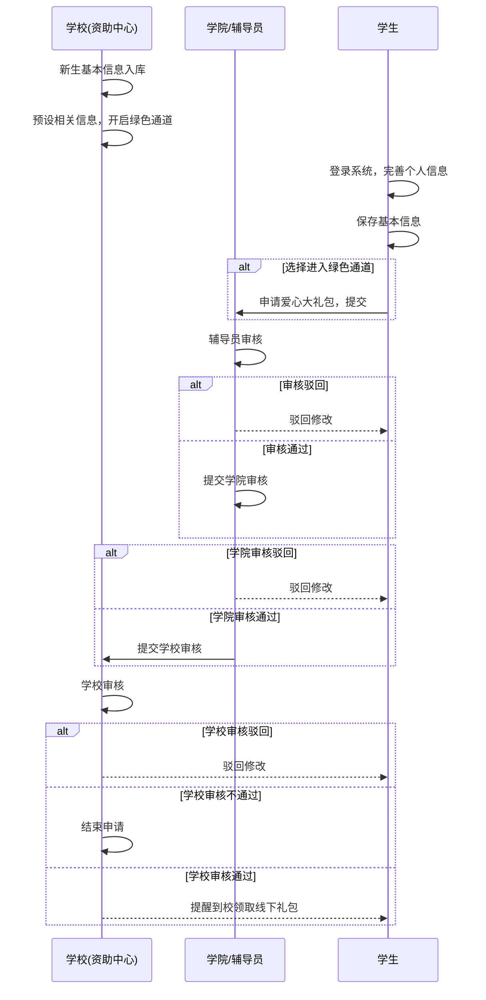
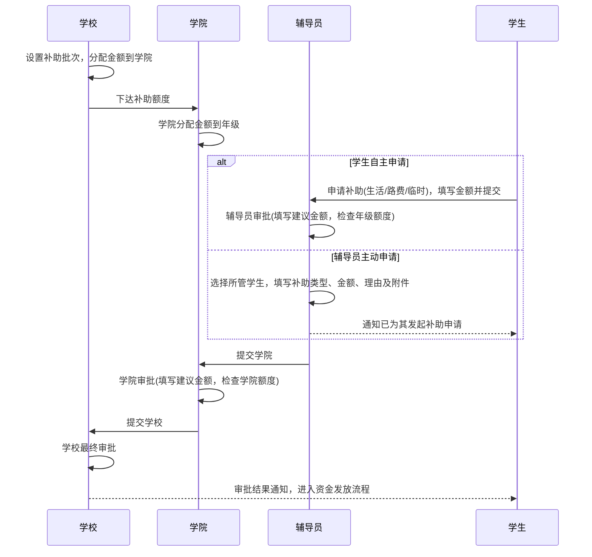
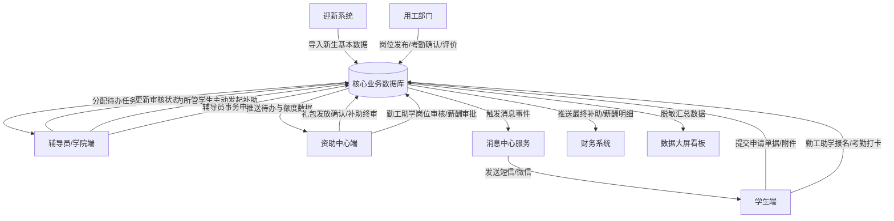

# 高校绿色通道系统需求分析文档

## 1. 项目概述

### 1.1 项目背景
随着国家对高校家庭经济困难学生资助工作重视程度的不断提升，各高校逐步建立了奖助学金、勤工助学、困难补助、学费减免等多种方式并举的资助政策体系。其中，“绿色通道”是确保家庭经济困难新生顺利入学的关键制度。
然而，传统的“绿色通道”和资助申请工作多采用线下办理、纸质表单流转的方式。这种模式存在以下痛点：
1. **效率低下**：新生报到期间人流量大，线下办理绿色通道往往需要排长队，耗费大量时间。
2. **信息滞后**：学生在收到录取通知书到正式报到期间，无法提前了解并办理相关资助事宜，容易产生焦虑情绪。
3. **精准度不足**：依靠人工审核材料，难以全面、准确地掌握学生的真实家庭经济状况，资助资源的分配缺乏数据支撑。
4. **管理不便**：纸质档案易丢失，数据难以统计分析，无法为学校的资助决策提供有效依据。

在此背景下，建设一套“高校绿色通道系统”显得尤为迫切。该系统旨在将绿色通道和困难补助等资助业务从线下搬到线上，实现资助工作的体系化和流程化。

### 1.2 项目目标
1. **实现资助业务线上化**：将绿色通道申请、困难补助申请等业务全流程线上流转，实现“让数据多跑路，让学生少跑腿”。
2. **前置资助服务**：学生在收到录取通知书后即可登录系统办理相关事宜，将资助关怀前置。
3. **拓宽资助申请渠道**：保留学生端自主申请，并允许辅导员根据日常掌握的学生困难情况主动发起补助申请。
4. **规范审批流程**：建立辅导员、学院、学校三级联动审批机制，确保审批过程公开、公平、公正。
5. **提升管理效能**：提供实时、多维的数据统计看板，为资助工作提供决策支持。
6. **拓展服务渠道**：支持PC端与移动端（微信/H5）多端访问，提升用户体验。

### 1.3 系统范围
本系统涵盖新生信息管理、绿色通道爱心大礼包申请与审批、困难补助申请与审批、学生与辅导员双入口申请、资助方案管理、消息通知、申诉反馈、数据统计与看板等核心功能模块。
系统需与学校现有的迎新系统、教务系统、财务系统、一卡通系统及统一身份认证平台进行深度对接，实现数据互联互通。

### 1.4 术语与缩略语定义表
| 术语/缩略语 | 定义说明 |
| :--- | :--- |
| 绿色通道 | 针对被录取入学、家庭经济困难的新生，一律先办理入学手续，然后再根据核实后的情况，分别采取不同办法予以资助的制度。 |
| 爱心大礼包 | 学校为家庭特别困难的新生免费提供的生活必需品套装。 |
| 辅导员主动申请 | 辅导员根据工作中掌握的情况，为所管学生发起困难补助申请；学生自主申请入口同时保留。 |
| OCR | Optical Character Recognition，光学字符识别，用于自动提取上传证件、证明材料中的文本信息。 |
| SSO | Single Sign-On，单点登录，用户只需登录一次即可访问所有相互信任的应用系统。 |

## 2. 总体需求

### 2.1 用户角色分析
| 角色名称 | 职责描述 | 权限范围 | 使用场景 |
| :--- | :--- | :--- | :--- |
| **学生（新生）** | 资助服务的申请者与受益者 | 完善个人信息、提交绿色通道及补助申请、查看审批进度、提交申诉与反馈。 | 收到录取通知书后在家申请；在校期间申请各类困难补助。 |
| **辅导员** | 资助申请的一线审核者，学生的直接管理者 | 审核学生自主申请，为所管学生主动发起补助申请，分配年级补助金额。 | 日常关注学生家庭情况变动；对未主动申请但确有困难的学生发起补助申请。 |
| **学院管理员** | 学院层面资助工作的统筹者 | 审核全院学生的资助申请，分配学院补助名额及金额，查看学院统计报表。 | 审核辅导员提交的申请；向学校资助中心汇报工作进度。 |
| **学校资助中心** | 全校资助工作的最高管理者与决策者 | 制定资助方案，开启/关闭绿色通道批次，最终审批各类申请，查看全校数据大屏与统计报表，管理资金拨付。 | 迎新季统筹全校绿色通道工作；日常管理各类资助方案及资金。 |
| **系统管理员** | 系统的技术保障者 | 管理用户账号、角色权限、系统参数字典，监控接口运行状态，处理系统异常。 | 系统日常运维；新学期初始化配置。 |

### 2.2 业务流程分析

#### 2.2.1 绿色通道总体业务流程


#### 2.2.2 困难补助申请流程


### 2.3 系统用例图
```mermaid
usecaseDiagram
    actor 学生 as S
    actor 辅导员 as T
    actor 学院管理员 as C
    actor 学校资助中心 as U
    actor 系统管理员 as A

    S --> (完善基本信息)
    S --> (申请爱心大礼包)
    S --> (申请困难补助)
    S --> (查看审批进度)
    S --> (提交申诉与反馈)

    T --> (主动发起学生补助申请)
    T --> (一级审批资助申请)
    T --> (分配年级补助金额)

    C --> (二级审批资助申请)
    C --> (分配学院补助金额/名额)
    C --> (查看学院统计报表)

    U --> (新生信息导入)
    U --> (批次与方案配置)
    U --> (三级审批资助申请)
    U --> (礼包领取确认)
    U --> (查看全校数据看板)
    U --> (资金预算与发放管理)

    A --> (用户与角色管理)
    A --> (权限与菜单管理)
    A --> (系统参数与字典管理)
    A --> (接口与日志监控)
```


## 3. 功能需求

### 【原有模块增强】

#### 3.1 新生信息管理模块
*   **操作角色**：学校资助中心
*   **需求描述**：提供新生基础数据的导入、校验、清洗与管理功能，为后续学生登录及资助申请提供数据基础。
*   **功能点列表**：
    *   **FR-3.1-001 批量导入**：支持下载标准Excel模板；导入时按学号去重；支持千万级数据异步导入并提供进度条；失败数据提供带错误原因的Excel下载。
    *   **FR-3.1-002 接口自动对接**：提供标准API，支持定时或实时从学校招生系统同步新生录取数据。
    *   **FR-3.1-003 数据清洗与校验**：自动校验身份证号合法性、手机号格式；对缺失关键字段（如学院、专业缺失）的数据进行高亮提示。
    *   **FR-3.1-004 历史数据迁移**：提供旧版系统数据的清洗导入工具，保留历史学生的资助记录。
    *   **FR-3.1-005 信息查询与修改**：支持多条件组合查询（学号、姓名、学院等）；支持单条记录的编辑与批量删除。
*   **界面要求**：列表页需包含高级搜索折叠面板，导入功能采用弹窗+拖拽上传方式。
*   **数据要求**：涉及 `gc_student`、`gc_student_family` 表，必须包含学号、姓名、学院、专业、身份证号等核心字段。
*   **业务规则与约束**：学号必须全校唯一；已参与当前批次绿色通道申请的学生信息，关键字段（如学号、学院）不可修改。

#### 3.2 绿色通道入口模块
*   **操作角色**：学生（新生）
*   **需求描述**：控制新生进入绿色通道申请页面的逻辑与权限。
*   **功能点列表**：
    *   **FR-3.2-001 信息完善后进入**：学生首次登录并完善必填基本信息后，系统展示“绿色通道政策解读”，确认后可进入申请页。
    *   **FR-3.2-002 主动点击进入**：学生在首页点击“绿色通道”Logo，系统校验个人必填信息和当前批次是否开放。
*   **界面要求**：政策解读需以图文并茂的弹窗展示，强制阅读倒计时（如5秒）后才可点击确认。
*   **业务规则与约束**：必须完善所有必填个人信息后才能触发入口逻辑；未配置当前进行中批次的，提示“当前不在绿色通道开放时间内”。

#### 3.3 绿色通道信息设置模块
*   **操作角色**：学校资助中心、学院管理员
*   **需求描述**：全局控制绿色通道及爱心大礼包的开放时间、申请范围及物资配置。
*   **功能点列表**：
    *   **FR-3.3-001 批次时间设置**：配置绿色通道的“学生申请开始时间”、“学生申请结束时间”、“学院提交截止时间”。
    *   **FR-3.3-002 批次基础设置**：设置所属学年；配置资金来源（中央财政/学校事业经费/社会捐赠）；选择可申请的年级范围。
    *   **FR-3.3-003 爱心大礼包物资库管理**：新增/编辑物品信息（名称、图片、尺寸、简介、单价、适用性别、是否必选/赠送）。支持从历史批次一键复制。
    *   **FR-3.3-004 礼包名额分配(校级)**：学校设置当前批次礼包可选总数上限，并将总名额分配给各个学院。支持随时调整。
    *   **FR-3.3-005 礼包名额分配(院级)**：学院管理员将学校分配的名额，进一步细化分配到各年级。
    *   **FR-3.3-006 动态开启与修改**：批次进行中或结束后，最高管理员可随时修改时间以重新开启通道。
*   **数据要求**：涉及 `gc_green_channel_batch`, `gc_gift_pack_item`, `gc_gift_pack_quota`。
*   **业务规则与约束**：学院分配给年级的名额总和不能超过学校分配给学院的名额；时间逻辑必须满足：开始时间 < 结束时间 <= 学院提交截止时间。

#### 3.4 绿色通道申请模块
*   **操作角色**：学生（新生）
*   **需求描述**：学生在线自主提交爱心大礼包申请。
*   **功能点列表**：
    *   **FR-3.4-001 学生自主申请**：学生选择可申请的礼包物品、尺码和数量，填写申请理由并上传必要附件。
    *   **FR-3.4-002 草稿与提交**：支持保存草稿；正式提交后进入辅导员初审。
    *   **FR-3.4-003 名额与库存校验**：提交和审核时校验年级名额、物品库存及每人可选数量。
*   **数据要求**：涉及 `gc_gift_pack_apply`, `gc_gift_pack_apply_item`, `gc_apply_attachment`。


#### 3.5 绿色通道审核模块
*   **操作角色**：辅导员、学院管理员、学校资助中心
*   **需求描述**：实现严格的三级审核流程。
*   **功能点列表**：
    *   **FR-3.5-001 辅导员初审**：查看学生申请材料；支持操作：通过、驳回修改、不通过。可修改除基本信息外的申请内容（需留痕）。
    *   **FR-3.5-002 辅导员批量提交**：在学生申请时间截止后，辅导员需将所有初审通过的名单"一次性"批量提交给学院。提交时系统校验该年级礼包名额是否超限。
    *   **FR-3.5-003 学院复审**：审核操作同辅导员。在学院截止时间前，将通过名单一次性提交学校。提交时校验学院礼包总名额是否超限。
    *   **FR-3.5-004 学校终审**：终审操作包括：通过、驳回、不通过、修改申请、取消已通过的绿色通道。
    *   **FR-3.5-005 批量审核与快捷模板**：各级审核均支持勾选多人进行批量"通过"或"驳回"；审核意见提供下拉快捷模板库，支持自定义添加。
    *   **FR-3.5-006 审核超时提醒**：系统后台定时任务扫描，对停留在某级审核节点超过预设天数（如3天）的申请，自动发送催办通知给相应审核人。
*   **业务规则与约束**：必须自下而上逐级审核，不可越级；驳回的申请，学生修改后重新提交，仍需从辅导员级开始重新审核；终审通过后锁定礼包名额和物品库存。


#### 3.6 爱心大礼包领取确认模块
*   **操作角色**：学校资助中心
*   **需求描述**：绿色通道终审通过后，管理礼包预留、到校领取和发放确认。
*   **功能点列表**：
    *   **FR-3.6-001 领取名单生成**：按批次生成终审通过的学生及礼包明细名单。
    *   **FR-3.6-002 二维码核销**：学生到校出示领取码，工作人员核验后将状态更新为“已领取”，防止重复发放。
    *   **FR-3.6-003 异常登记**：支持登记尺码更换、缺货后补发等情况并留存处理记录。

#### 3.7 审核流程查看模块
*   **操作角色**：学生、辅导员、学院管理员、学校资助中心
*   **需求描述**：全景展示申请单的流转轨迹。
*   **功能点列表**：
    *   **FR-3.7-001 学生端进度条**：以时间轴（Timeline）UI组件展示：已提交 -> 辅导员审核中 -> 学院审核中 -> 学校审核中 -> 审核通过/不通过。各节点附带处理时间和审核意见（驳回或不通过必须显示原因）。
    *   **FR-3.7-002 最终状态提示**：若最终通过，突出显示爱心大礼包的领取时间、地点和领取码。
    *   **FR-3.7-003 管理端流程追踪**：各级管理员可查看权限范围内的申请列表。点击“流转记录”，以弹窗形式展示详细的审核人、审核动作、意见及修改留痕（JSON比对快照）。

#### 3.8 绿色通道申请补录模块
*   **操作角色**：学校资助中心
*   **需求描述**：处理线下申请或逾期申请的异常情况。
*   **功能点列表**：
    *   **FR-3.8-001 快捷检索**：通过学号或身份证号快速定位系统中已有的学生（或跳转到新增学生页面）。
    *   **FR-3.8-002 表单补录**：在一个页面内完成爱心大礼包信息的集中录入。
    *   **FR-3.8-003 状态直达**：补录提交的数据跳过常规三级审核，直接标记为“终审通过”并进入礼包领取名单。

### 【新增模块（扩展核心）】

#### 3.9 困难补助申请模块
*   **操作角色**：学校、学院、辅导员、学生
*   **需求描述**：将业务流程图中第11步“申请补助”细化落地，实现完整的资金分配与审批闭环。
*   **功能点列表**：
    *   **FR-3.9-001 补助批次与总盘控制**：学校资助中心创建补助批次（生活补助/路费补助/临时困难补助），设置全校总资金盘。
    *   **FR-3.9-002 额度自上而下分配**：学校将总金额分配给各学院 -> 学院将分配到的金额继续下发给各年级。系统需展示“总额度、已分配、可用余额”。
    *   **FR-3.9-003 学生自主申请**：保留学生端自主申请入口。学生选择补助类型，填写期望申请金额、申请理由，并上传必要的证明附件（如路费车票、临时困难证明）。
    *   **FR-3.9-004 审批与控费检查**：
        *   辅导员审批：审核材料，填写建议补助金额。提交时，系统强校验“辅导员建议金额总和”是否超出“年级分配总额”。若超出，阻止提交。
        *   学院审批：核实辅导员建议，填写学院建议金额。系统强校验“学院建议金额总和”是否超出“学院分配总额”。
        *   学校审批：终审裁定最终发放金额。
    *   **FR-3.9-005 补助发放台账**：终审通过后，生成补助发放明细台账，对接财务模块。
*   **业务规则与约束**：任何一级的审批金额不得超过上一级分配的可用额度余额；同一批次同一种补助，学生只能申请一次。

#### 3.10 辅导员主动补助申请模块
*   **操作角色**：辅导员、学院管理员、学校资助中心、学生
*   **需求描述**：在不影响学生端自主申请的前提下，辅导员可为所管学生主动发起补助申请。两种入口共用补助批次、额度、审批和发放台账。
*   **功能点列表**：
    *   **FR-3.10-001 辅导员发起**：辅导员在“补助申请”页面选择所管单个学生，填写补助类型、申请金额、申请理由并上传证明附件。
    *   **FR-3.10-002 发起身份留痕**：申请单明确记录“学生自主申请/辅导员主动申请”和实际发起人，不得伪装为学生操作。
    *   **FR-3.10-003 审批起点**：学生自主申请从辅导员初审开始；辅导员主动申请不再由本人审批，提交后直接进入学院审批。
    *   **FR-3.10-004 学生知情与补材料**：辅导员提交后系统通知学生；学生可查看申请和进度，并在被要求时补充附件，但不得更改发起人信息。
    *   **FR-3.10-005 防重复校验**：同一学生在同一批次、同一补助类型只能存在一条有效申请，无论由学生还是辅导员发起。
*   **数据要求**：共用 `gc_subsidy_apply`，通过 `applicant_type` 和 `applicant_user_id` 记录发起方。

#### 3.11 消息通知中心模块
*   **操作角色**：全员
*   **需求描述**：统一的系统消息出口，确保通知触达率。
*   **功能点列表**：
    *   **FR-3.11-001 消息模板管理**：预置各种业务触发模板（如：审批通过模板、审批驳回模板、资金到账模板），支持使用变量（如`${StudentName}`）。
    *   **FR-3.11-002 多渠道触达**：系统内通过站内信通知；对接学校短信网关发短信；对接邮件服务器；对接企业微信/微信公众号模板消息推送。
    *   **FR-3.11-003 自动业务触发**：在绿色通道审批流转、补助申请驳回、资金确认到账等关键节点，自动调用接口发信。
    *   **FR-3.11-004 手动群发与记录**：管理员可按年级、班级筛选人群手动群发通知；系统保留所有发送记录及已读/未读状态。
    *   **FR-3.11-005 偏好设置**：用户可自行设置免打扰时间段或关闭非必要的短信通道（重要通知强制开启）。

#### 3.12 资助方案管理模块
*   **操作角色**：学校资助中心
*   **需求描述**：将各种类型的奖助学金、临时补助抽象化，实现灵活的规则配置。
*   **功能点列表**：
    *   **FR-3.12-001 方案基础定义**：配置资助方案名称、资金来源、金额标准（固定金额或区间）、名额限制、有效期限。
    *   **FR-3.12-002 多维条件组合**：通过规则引擎界面，采用逻辑运算（AND/OR）组合准入条件。例如：（建档立卡 == 是 OR 贫困等级 == 特别困难） AND （上一学年无挂科）。
    *   **FR-3.12-003 方案生命周期**：支持方案的存为草稿、正式发布、提前下线。
    *   **FR-3.12-004 匹配度评估报告**：方案发布前，可进行“试运行计算”，系统预估出全校符合条件的学生人数，辅助决策者调整金额或条件。

#### 3.13 申诉与反馈模块
*   **操作角色**：学生、辅导员、学院、学校
*   **需求描述**：提供阳光透明的异议处理通道和满意度调查机制。
*   **功能点列表**：
    *   **FR-3.13-001 结果申诉通道**：对于申请被“不通过”的学生，提供为期3天的申诉窗口期。学生需填写申诉理由并补充新的证明材料。
    *   **FR-3.13-002 申诉调查与回复**：申诉流转至做出“不通过”决定的节点管理员处。管理员需进行线下核实调查，并在系统中录入处理结论反馈给学生。
    *   **FR-3.13-003 满意度问卷发放**：资助季结束后，系统自动向受助学生派发标准化问卷（5分制+主观建议）。
    *   **FR-3.13-004 舆情分析**：后台利用简单的自然语言处理（NLP，如关键词云），对学生提交的主观反馈意见进行高频词提取。

#### 3.14 数据看板与可视化模块
*   **操作角色**：学校领导、资助中心
*   **需求描述**：打造资助工作驾驶舱，实时监控业务进展。
*   **功能点列表**：
    *   **FR-3.14-001 迎新大屏投影**：暗黑科技感UI风格，提供F11全屏免登录展示模式，专供迎新现场大屏投放。
    *   **FR-3.14-002 核心指标实时刷新**：通过WebSocket推送，实时滚动展示：累计申请总人数、今日新增人数、审批通过率、补助发放总额、大礼包发放总数等。
    *   **FR-3.14-003 多维图表联动**：
        *   **学院对比**（柱状图）：各学院申请进度与通过率横向对比。
        *   **生源地分布**（热力地图）：全校受助学生的生源省份/城市热力分布。
        *   **补助结构**（饼状图）：生活补助、路费补助与临时困难补助的人数和金额比例。
    *   **FR-3.14-004 年度趋势对比**（折线图）：将本年数据与往年历史数据进行同环比分析。

#### 3.15 资金管理与发放模块
*   **操作角色**：学校资助中心
*   **需求描述**：闭环管理资助资金从预算到学生账户的最后一公里。
*   **功能点列表**：
    *   **FR-3.15-001 预算建账**：录入各年度、各渠道（财政、社会捐赠）的资助预算收入。
    *   **FR-3.15-002 发放清单生成**：根据终审通过的补助名单，自动生成符合财务格式的资金拨付清单（含学生姓名、学号、银行卡号、金额）。
    *   **FR-3.15-003 财务状态同步**：提供接口给财务系统，或支持人工导入银行的汇款成功回执单。
    *   **FR-3.15-004 到账确认与对账**：系统自动将“已发放”状态同步给学生端。支持生成资金拨付对账单。

#### 3.16 统计报表模块 (增强版)
*   **操作角色**：辅导员、学院、学校
*   **需求描述**：满足日常繁杂的数据台账导出及统计汇报需求。
*   **功能点列表**：
    *   **FR-3.16-001 自定义字段报表**：提供字段超市（如：学号、姓名、性别、民族、困难等级、补助金额、申请发起方、申请状态等50+字段），用户按需勾选列生成清单。
    *   **FR-3.16-002 复杂分组统计**：按学院+年级维度汇总人数；按补助类型和发起方（学生/辅导员）生成人数、金额统计矩阵表。
    *   **FR-3.16-003 大礼包消耗统计**：按物资SKU统计申请总数及尺码分布，为采购部提供准确数据。
    *   **FR-3.16-004 模板复用与导出**：用户可将常用的自定义列配置保存为“我的报表模板”。支持导出为Excel(带样式)、PDF、CSV格式；支持连带照片附件打包下载。

#### 3.17 系统管理模块
*   **操作角色**：系统管理员
*   **需求描述**：系统底层的基础支撑模块，控制系统的安全与运行参数。
*   **功能点列表**：
    *   **FR-3.17-001 用户与权限**：基于RBAC模型。管理用户账号、重置密码；定义角色；分配菜单级、按钮级权限。
    *   **FR-3.17-002 严格的数据权限控制**：
        *   系统根据用户的组织架构属性，自动注入数据过滤条件：辅导员只能查阅所带班级数据；学院管理员只能查阅本院数据；资助中心拥有全校视图。
    *   **FR-3.17-003 全面操作审计日志**：记录每一次增删改操作的时间、IP、用户、请求URL、入参出参，关键业务操作提供高亮标注，保留至少180天。
    *   **FR-3.17-004 数据字典与参数配置**：动态管理下拉框枚举值（如民族、政治面貌）。配置系统全局参数（如附件最大MB限制、申诉窗口期、客服电话）。

#### 3.18 对接与集成接口模块
*   **操作角色**：系统管理员、第三方系统
*   **需求描述**：打破数据孤岛，与校内生态深度融合。
*   **功能点列表**：
    *   **FR-3.18-001 迎新/教务双向同步**：入站获取新生名单与学籍变动（休退转）；出站推送绿色通道办理完成状态，解除新生报到锁。
    *   **FR-3.18-002 统一认证(SSO)**：对接学校CAS或OAuth2.0单点登录服务器，学生/教师使用统一门户账号免密进入系统。
    *   **FR-3.18-003 API网关与监控**：提供标准RESTful API文档；对外部系统的调用进行Token鉴权验证；统计接口调用成功率及耗时，异常实时告警。


#### 3.19 辅导员事务申请模块
*   **操作角色**：辅导员、学院管理员、学校资助中心
*   **需求描述**：辅导员在日常学生管理中需要提交各类事务性申请（如班级资助专项工作经费申请、困难学生认定复核申请等），需要一个统一的事务申请平台来规范化管理这些流程。对具体学生发起补助的业务统一使用3.10模块，不在本模块重复建单。
*   **功能点列表**：
    *   **FR-3.19-001 申请类型配置**：系统管理员/学校资助中心可维护辅导员事务申请的类型列表，包括但不限于：
        *   班级资助专项工作经费申请
        *   学生困难等级调整申请
        *   资助材料补充提交申请
        *   特殊情况说明申请
        每种申请类型可配置所需的表单字段模板（如是否需要金额字段、是否需要学生关联、审批级别等）。
    *   **FR-3.19-002 辅导员发起申请**：辅导员选择申请类型后，系统动态加载对应的表单模板。填写申请标题、申请事由详细说明、涉及学生（可关联多个学生）、申请金额（如适用）、紧急程度（普通/紧急/特急）。支持上传附件材料。支持保存草稿。
    *   **FR-3.19-003 关联学生选择器**：提供学生快速检索组件，辅导员可通过学号/姓名搜索并关联一个或多个所管学生到当前申请。关联后展示学生基本信息和经学校认定的困难等级。
    *   **FR-3.19-004 二级审批流程**：
        *   辅导员提交 → 学院管理员审批（可通过/驳回/转交）
        *   学院审批通过 → 学校资助中心审批（可通过/驳回/备案）
        *   紧急类申请可配置走加急通道，系统自动发送加急催办通知
    *   **FR-3.19-005 审批工作台**：学院管理员和资助中心在自己的工作台中可看到辅导员提交的各类待办事务，支持按申请类型、紧急程度、提交时间筛选排序。
    *   **FR-3.19-006 申请进度追踪**：辅导员可在"我的申请"列表中查看所有历史申请及当前审批进度，支持按状态（草稿/审批中/已通过/已驳回）筛选。
    *   **FR-3.19-007 申请台账与统计**：学校资助中心可查看全校辅导员事务申请的汇总台账，支持按学院、申请类型、时间段统计分析，导出Excel报表。
    *   **FR-3.19-008 消息联动**：申请提交、审批通过、审批驳回等关键节点自动触发消息通知中心发送站内信/短信/微信通知。
*   **界面要求**：
    *   申请页面采用动态表单渲染，根据选择的申请类型自动切换表单字段。
    *   审批工作台以卡片式/列表式两种视图切换展示，待办事项突出显示紧急标识。
    *   申请详情页展示完整的审批时间轴，各节点包含审批人、操作、意见。
*   **数据要求**：涉及 `gc_tutor_apply_type`（申请类型配置表）、`gc_tutor_application`（辅导员申请主表）、`gc_tutor_app_student`（申请关联学生表）、`gc_tutor_app_review`（辅导员申请审核记录表）。
*   **业务规则与约束**：
    *   辅导员只能关联自己所管班级的学生。
    *   涉及金额的申请，金额不能为负数且不能超过单笔上限（系统参数控制）。
    *   紧急/特急类申请需在24小时/4小时内有审批响应，否则自动升级催办至上级。
    *   已通过的申请原则上不可撤销，如有特殊情况需由学校资助中心手动处理。

#### 3.20 勤工助学管理模块
*   **操作角色**：学校资助中心、学院管理员、用工部门、辅导员、学生
*   **需求描述**：勤工助学是高校学生资助体系的重要组成部分，通过组织经济困难学生参加校内有偿劳动，培养学生自立自强精神的同时提供经济帮助。本模块提供从岗位发布、学生申请、录用管理、日常考勤到薪酬发放的全流程线上化管理。
*   **功能点列表**：
    *   **FR-3.20-001 勤工助学批次管理**：学校资助中心按学期/学年创建勤工助学招聘批次，设置批次名称、所属学年学期、报名开始/截止时间、面试时间段、上岗开始/结束日期、全校岗位总数上限。
    *   **FR-3.20-002 岗位发布与管理**：
        *   用工部门（学院/行政机关/图书馆/后勤等）创建勤工助学岗位，填写：岗位名称、岗位描述、工作地点、工作时间要求（如每周不超过8小时）、岗位类型（固定岗/临时岗）、招聘人数、薪酬标准（元/小时或元/月）、岗位要求（如专业限制、技能要求）、联系人信息。
        *   支持岗位的上架/下架/编辑。
        *   学校资助中心对用工部门发布的岗位进行审核（通过/驳回），审核通过后岗位才对学生可见。
    *   **FR-3.20-003 岗位浏览与检索（学生端）**：
        *   学生端展示所有已上架的勤工助学岗位列表，支持按岗位类型、薪酬范围、工作地点、用工部门等条件筛选。
        *   岗位详情页展示完整的岗位信息、已报名人数/招聘总数进度条。
        *   支持岗位收藏功能。
    *   **FR-3.20-004 学生报名申请**：
        *   学生选择岗位后填写申请表：自我介绍、可工作时间段、特长/经历、申请理由。
        *   系统自动附带学生的基本信息和经学校认定的困难等级供审核参考。
        *   限制：每个学生同一批次最多可报名3个岗位（系统参数可配置）。
        *   辅导员可查看本班学生的报名情况并给出推荐意见（可选）。
    *   **FR-3.20-005 面试与录用管理**：
        *   用工部门查看报名该岗位的学生列表，可按贫困等级优先排序，进行线上初筛。
        *   支持标记面试状态（待面试/已面试/面试通过/面试不通过）。
        *   面试通过后，用工部门发起录用。录用需经学校资助中心最终审批确认。
        *   资助中心审批时需校验：该学生是否已在其他岗位被录用（同一时间段内最多持有1个固定岗位）；全校岗位录用总数是否超出批次上限。
        *   录用确认后，系统自动通知学生"录用通知"。
    *   **FR-3.20-006 日常考勤管理**：
        *   录用的学生每日/每周通过系统进行打卡签到签退（支持定位打卡或二维码扫码打卡）。
        *   用工部门负责人可对考勤记录进行确认/修正（如补打卡审批）。
        *   月末自动汇总每位学生的出勤天数、工作时长。
        *   请假功能：学生可在线提交请假申请，用工部门审批。
    *   **FR-3.20-007 月度工作评价**：
        *   用工部门每月对在岗学生进行工作表现评价（评分制1-5分 + 文字评语）。
        *   连续两个月评价低于2分的学生，系统自动发出预警提醒给资助中心。
    *   **FR-3.20-008 薪酬核算与发放**：
        *   月末由系统根据考勤记录自动核算每位学生应发薪酬（工作时长 × 时薪）。
        *   用工部门确认核算结果后提交给学校资助中心。
        *   资助中心汇总全校当月薪酬发放清单，审批通过后对接资金发放模块（3.15），生成财务拨付单。
        *   学生可在个人中心查看每月薪酬明细及发放状态。
    *   **FR-3.20-009 合同/协议管理**：
        *   录用后系统自动生成电子版勤工助学协议（模板由资助中心维护），学生在线确认签署。
        *   协议内容包括：岗位信息、工作时间约定、薪酬标准、双方权利义务、安全注意事项等。
        *   支持协议到期自动提醒和续签流程。
    *   **FR-3.20-010 岗位变动管理**：支持在岗学生的调岗（换岗位）、离岗（主动辞退/违规解聘）操作。离岗需走审批流程。离岗后释放岗位名额。
    *   **FR-3.20-011 勤工助学统计报表**：
        *   岗位维度统计：各部门岗位数、报名人数、录用人数、在岗率。
        *   学生维度统计：按学院/贫困等级统计参与勤工助学的人数及占比。
        *   薪酬维度统计：月度/学期薪酬发放汇总、各部门薪酬预算执行率。
        *   支持报表导出（Excel/PDF）。
*   **界面要求**：
    *   学生端岗位列表采用卡片式布局，每张卡片显示岗位核心信息（名称、地点、薪酬、剩余名额），鼠标悬停显示详细描述。
    *   考勤打卡页面需醒目展示当前打卡状态（已签到/未签到）及当月累计工时。
    *   薪酬明细页面按月份展开，列表展示每日工作时长和对应金额。
    *   管理端的岗位管理页面需支持高级筛选面板和批量操作（批量上架/下架/审核）。
*   **数据要求**：涉及 `gc_work_study_batch`（批次表）、`gc_work_study_position`（岗位表）、`gc_work_study_apply`（报名申请表）、`gc_work_study_hire`（录用记录表）、`gc_work_study_attendance`（考勤记录表）、`gc_work_study_evaluation`（月度评价表）、`gc_work_study_salary`（薪酬记录表）、`gc_work_study_agreement`（协议表）。
*   **业务规则与约束**：
    *   家庭经济困难学生优先录用（贫困等级高的排序靠前）。
    *   学生每周工作时间不得超过8小时（国家规定），系统需在考勤层面进行强校验。
    *   学生同一时间段内最多持有1个固定岗位（可同时持有临时岗）。
    *   薪酬标准不得低于当地最低小时工资标准（系统参数配置）。
    *   岗位招聘人数不得超过用工部门申请的上限。
    *   学生因违规被解聘的，本学期内不得再申请其他勤工助学岗位。


## 4. 非功能需求

### 4.1 性能需求
1. **响应时间**：系统前台页面响应时间应控制在 2 秒以内，复杂统计报表查询响应时间不超过 5 秒。
2. **并发能力**：迎新高峰期，系统需支持至少 1000 人并发访问，保证绿色通道申请提交不卡顿。
3. **数据容量**：支持每年约 10,000 名新生数据的导入，系统设计需考虑至少 5-10 年历史数据的平稳存储与查询性能，估算存储空间年增长量约 10GB（含附件）。

### 4.2 安全需求
1. **访问控制**：实行严格的身份认证和基于角色的权限控制（RBAC），防止越权操作，特别是跨学院、跨班级的数据越权。
2. **数据加密**：敏感数据（如密码、身份证号后6位）在数据库中必须加密存储（如 bcrypt/AES）；通信过程强制使用 HTTPS 加密协议。
3. **隐私保护**：展示学生家庭经济情况、补助金额等敏感界面，需有水印防截图机制；非必须业务场景对身份证、手机号进行脱敏展示（如 `138****1234`）。
4. **防并发篡改**：审批核心环节需引入乐观锁或分布式锁，防止并发提交导致额度超发或状态错乱。

### 4.3 可用性与兼容性需求
1. **多端适配**：系统前台（学生端）必须支持移动端访问（微信小程序或 H5 自适应），后台管理端支持 PC 主流浏览器（Chrome, Firefox, Edge, Safari）。
2. **易用性**：界面交互需符合现代 Web 审美（扁平化设计），针对学生申请表单，必须提供清晰的进度指示器和友好的输入错误提示。
3. **无障碍设计**：关键业务流程应考虑信息无障碍标准，提供清晰的高对比度提示。

### 4.4 可维护性与可扩展性需求
1. **代码规范**：前后端代码需遵循业界通用规范（如阿里巴巴Java开发规范、ESLint），并具备充足的注释说明。
2. **微服务/模块化设计**：资助方案引擎、消息中心等独立性强的模块应采用低耦合设计，便于后期独立剥离或升级。

## 5. 数据需求

### 5.1 核心数据字典
| 实体 | 字段名称 | 字段代码 | 类型 | 长度 | 约束 | 描述 |
| :--- | :--- | :--- | :--- | :--- | :--- | :--- |
| **学生表** | 学号 | `student_no` | VARCHAR | 20 | 主键，唯一 | 新生学号 |
| | 姓名 | `name` | VARCHAR | 50 | 必填 | 真实姓名 |
| | 身份证号 | `id_card` | VARCHAR | 18 | 必填，唯一 | 加密存储 |
| | 困难等级 | `poverty_level` | TINYINT | 1 | 否 | 1-特别困难, 2-困难, 3-一般困难, 4-不困难 |
| **批次表** | 批次名 | `batch_name` | VARCHAR | 100 | 必填 | 如"2023级新生绿色通道" |
| | 开始时间 | `start_time` | DATETIME | - | 必填 | 学生可开始申请时间 |
| | 结束时间 | `end_time` | DATETIME | - | 必填 | 学生申请截止时间 |
| **申请表** | 申请编号 | `apply_no` | VARCHAR | 32 | 主键，唯一 | 自动生成的业务流水号 |
| | 申请状态 | `status` | TINYINT | 1 | 必填 | 1-草稿,2-待辅导员审,3-已通过等 |
| | 发起方 | `applicant_type` | TINYINT | 1 | 必填 | 1-学生自主申请, 2-辅导员主动申请 |
| | 补助金额 | `apply_amount` | DECIMAL | 10,2| 必填 | 大于0且受批次和额度约束 |
| **审核表** | 审核人 | `reviewer_id`| BIGINT | 20 | 必填 | 关联用户表ID |
| | 审核动作 | `action` | VARCHAR | 20 | 必填 | PASS, REJECT, MODIFY |
| | 审核意见 | `comment` | VARCHAR | 500 | 驳回必填 | - |
| **勤工助学岗位表** | 岗位名称 | `position_name` | VARCHAR | 100 | 必填 | 岗位全称 |
| | 薪酬标准 | `salary_rate` | DECIMAL | 8,2 | 必填 | 元/小时 |
| | 招聘人数 | `recruit_count` | INT | - | 必填 | 该岗位招聘总人数 |
| | 岗位状态 | `status` | TINYINT | 1 | 必填 | 0-草稿 1-待审核 2-已上架 3-已下架 |
| **勤工助学考勤表** | 签到时间 | `check_in_time` | DATETIME | - | 必填 | 打卡签到时间 |
| | 签退时间 | `check_out_time` | DATETIME | - | 否 | 打卡签退时间 |
| | 工作时长 | `work_hours` | DECIMAL | 5,2 | 否 | 签退时系统自动计算(小时) |

### 5.2 核心数据流图


## 6. 附录
### 6.1 参考文献
*   《教育部等六部门关于做好家庭经济困难学生认定工作的指导意见》
*   《高等学校勤工助学管理办法（2018年修订）》（教财〔2018〕12号）
*   学校现行《家庭经济困难学生资助管理办法》
*   学校现行《学生勤工助学管理实施细则》
*   统一身份认证平台对接开发文档 v2.0

### 6.2 修订记录
| 版本号 | 修订日期 | 修订人 | 修订内容摘要 |
| :--- | :--- | :--- | :--- |
| V1.0 | 2026-07-11 | 需求分析组 | 初稿建立，在原8个模块基础上扩展10个新模块，细化业务规则与数据库字典说明。 |
| V1.1 | 2026-07-14 | 需求分析组 | 新增3.19辅导员事务申请模块和3.20勤工助学管理模块，功能模块总数增至20个。 |
| V1.2 | 2026-07-14 | 需求分析组 | 删除原3.10数据分析模块和费用延缓类功能；保留学生自主申请，新增辅导员主动发起补助申请。 |
